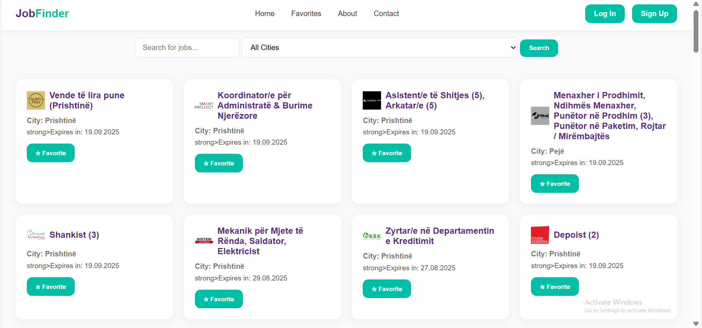
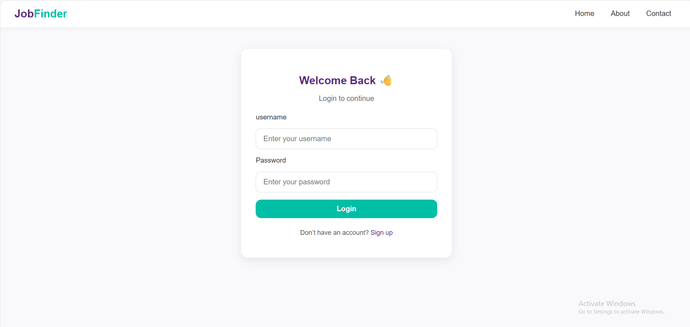
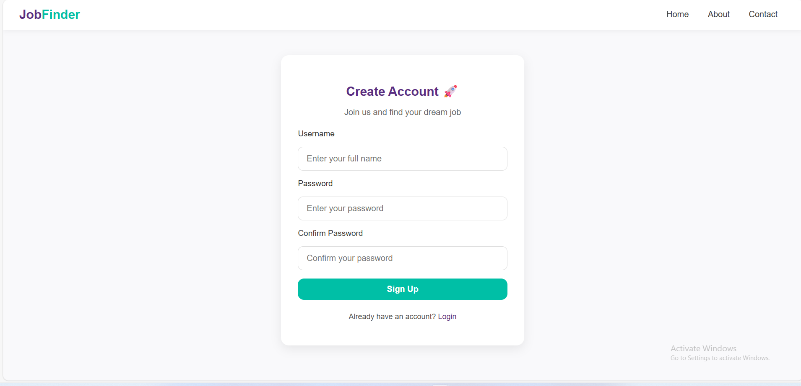
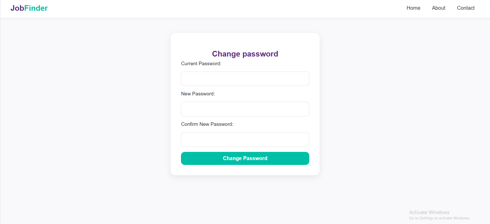
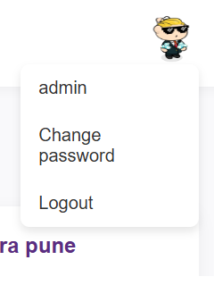
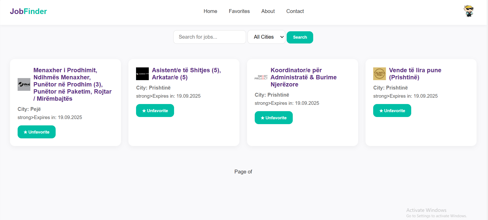
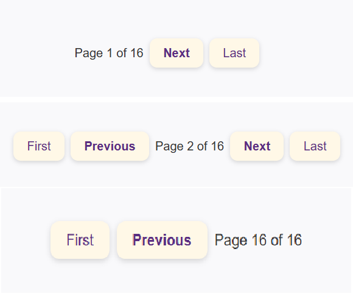

JobFinder

A Django-powered job Finding platform.

Overview
JobFinder is a web application built with Django that allows users to browse, filter, and save job postings. It’s designed to mimic a real-world job board with essential features such as authentication, favorites, search filters, and pagination.
This project is great for:
Developers learning Django (authentication, views, templates, models).

Employers or recruiters wanting to manage job postings.

Users looking for a structured, user-friendly job search experience.

Features
User Authentication – Sign up, log in, log out, and change password.

Favorites – Save jobs to your favorites list.

Advanced Search & Filters – Filter by keyword and city, with an “All cities” option.

Pagination – Browse jobs in sets of 80 per page.

Responsive UI – Styled with clean buttons and navigation.

Secure by Design – Basic Django security best practices applied (CSRF, CSP considerations).

Installation & Setup
1. Clone the Repository
git clone https://github.com/mbabaj/jobfinder.git
cd jobfinder
2. Create a Virtual Environment
python -m venv venv
source venv/bin/activate   # On Linux/Mac
venv\Scripts\activate      # On Windows
3. Install Dependencies
pip install -r requirements.txt
4. Apply Migrations
python manage.py migrate
5. Run Development Server
python manage.py runserver

Screenshots
Home Page

Login page

Sign Up Page

Change Password page

Dropdown menu

Favorites page

Puginatio Buttons

Configuration
SECRET_KEY=your-django-secret-key
DEBUG=True
ALLOWED_HOSTS=127.0.0.1,localhost